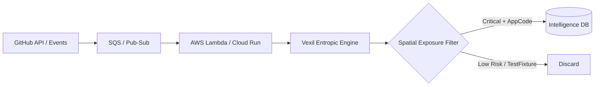
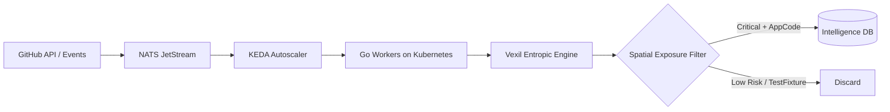

# Xiphos: Architecture of Scale

## 1. Pipeline Overview

### Managed Stack (AWS / GCP)

### Open-Source Stack (Self-Hosted)

> **Note on NATS:** NATS JetStream serves as the **message queue** (the channel through which jobs reach workers), not as an execution platform. The correct comparison is: *AWS Lambda / Google Cloud Run (managed platforms) vs. NATS JetStream + KEDA + Kubernetes (equivalent open-source stack)*. For lighter operational overhead, **HashiCorp Nomad** can replace Kubernetes, with native NATS and Consul integration.

## 2. Infrastructure Specifications

### Micro-Container (The Blade)
- **Base:** Alpine 3.19
- **Binary:** Vexil (CGO_ENABLED=0, statically linked, stripped)
- **Dependencies:** Git (minimal install), ca-certificates
- **Footprint:** < 20MB image size
- **Cold-start:** < 100ms

### Execution Layer
The **execution layer** determines where the Vexil binary runs. Options:
| Platform | Type | Pros | Cons |
|---|---|---|---|
| AWS Lambda | Managed | Zero ops, auto-scale | Vendor lock-in, quota limits |
| Google Cloud Run | Managed | Multi-request concurrency | Vendor lock-in |
| OpenFaaS | Self-hosted FaaS | Runs on K8s or Docker Swarm, Go-native | Requires cluster management |
| Knative | Self-hosted FaaS | Cloud Run's open-source base | Complex K8s setup |
| Long-running Go workers | Self-hosted | No FaaS overhead, highest throughput | Manual lifecycle management |

### Orchestration Layer
The **orchestration layer** decides when and how many instances to run. This is separate from execution:
| Component | Role | Notes |
|---|---|---|
| KEDA | Event-driven autoscaler | Scales K8s pods based on NATS queue depth |
| NATS JetStream | Message queue / work distribution | Durable, at-least-once delivery |
| HashiCorp Nomad | Alternative orchestrator | Lighter than K8s, native NATS integration |

### Performance Boundary Conditions
- **Concurrency:** AWS Lambda default is 1,000 concurrent executions per region per account. Reaching 10,000+ requires a formal quota increase. Cloud Run uses multi-request concurrency per instance, so the equivalent instance count is lower. OpenFaaS + KEDA on Kubernetes can reach this scale without vendor dependency, at the cost of operational complexity.
- **Throughput (1,000 repos in 30s):** Achievable for small repositories (< 1MB) analyzed via the GitHub Content API, scanning only recently modified files. For full repository clones with `--git-aware` history scanning, the bottleneck is bandwidth and GitHub API rate limits (5,000 requests/hour per authenticated token), making this metric unrealistic without privileged access.
- **Volume (TB/h):** This refers to **processing capacity**, not ingestion capacity. The GitHub Events API generates 500GB–1TB of event metadata per day — not per hour — and events contain metadata, not file content. Processing actual code at TB/h requires access to the GitHub Archive Program, a direct partnership, or a distributed crawling strategy that respects rate limits. The distinction between processing capacity and ingestion capacity is the real limiting factor.

## 3. Vexil Engine Architecture
The Xiphos pipeline uses the following Vexil internal components:
- **`internal/detector`** — 17 pattern rules with Shannon entropy filtering, structural validators, and confidence scoring.
- **`internal/scanner`** — Concurrent file scanner with priority-based file scoring, 10MiB per-file limit, and semaphore-bounded goroutine pool (default: 16 workers).
- **`internal/classifier`** — Spatial Exposure context classifier (`application_code`, `ci_config`, `infra_config`, `test_fixture`, `example_file`).
- **`internal/compliance`** — Compliance enrichment mapping (ISO 27001, NIS2, DORA, IEC 62443) with blast radius and remediation steps.
- **`internal/gitscanner`** — Streaming `git log` history scanner with shallow clone detection.

## 4. High-Value Targeting (Crypto Focus)
The research will focus on extending Vexil's detection patterns to specifically target:
- **EVM Private Keys:** 64 hexchars, high-entropy (> 4.8 bits).
- **Mnemonic Phrases:** Entropy of English words vs. cryptographic randomness.
- **Cloud IAM Tokens:** Broadening to multi-cloud lateral movement detection.

## 5. Threat Intelligence Use Cases
- **Proactive Leak Prevention:** Detecting a secret seconds after a push event.
- **Historical Archaeology:** Using `--git-aware` to find secrets deleted years ago.
- **Supply Chain Security:** Scanning package managers (NPM/PyPI) for embedded credentials.
